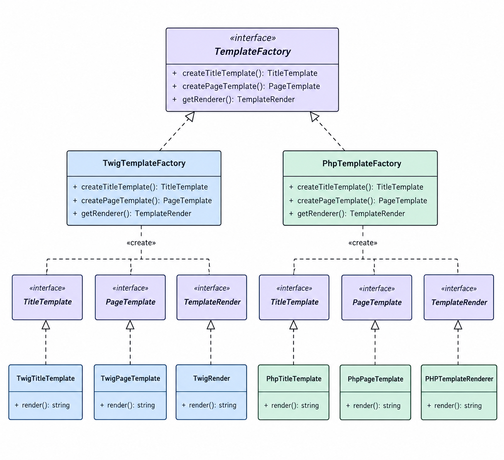
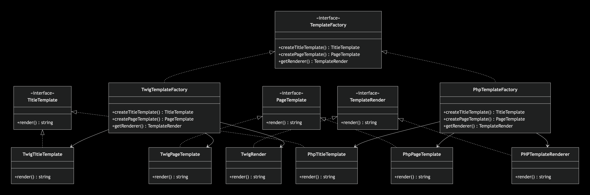
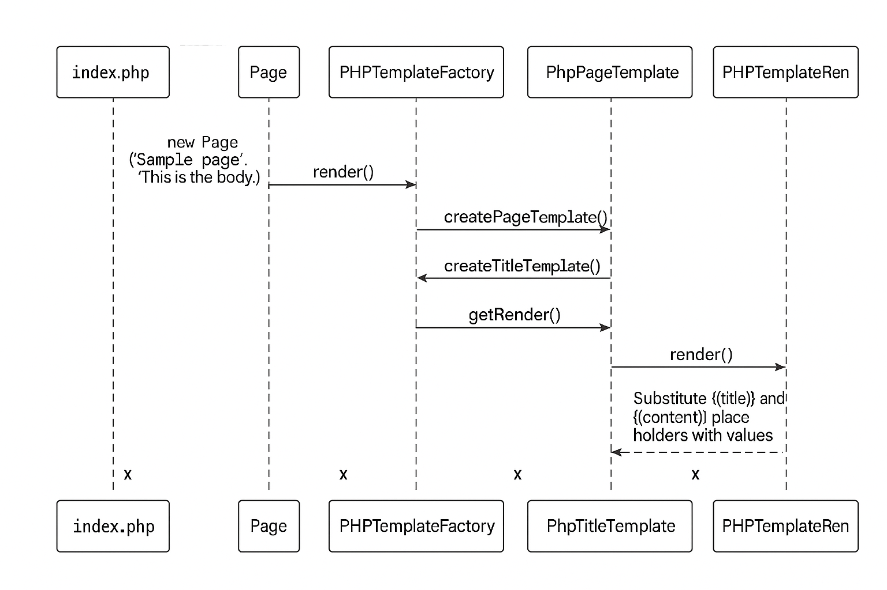

# 🏭 Abstract Factory Pattern

## 📑 Índice

1. [Abstract Factory Pattern](#1-abstract-factory-pattern)
   1. [¿Para qué sirve?](#para-qué-sirve)
   2. [Cuándo usarlo](#cuándo-usarlo)
   3. [Objetivo](#objetivo)
2. [¿Cómo implementar el patrón para resolver el problema?](#cómo-implementar-el-patrón-para-resolver-el-problema)
   1. [Productos a fabricar](#productos-a-fabricar)
   2. [Familia Twig](#familia-twig)
   3. [Familia PHPTemplate](#familia-phptemplate)
   4. [¿Dónde está la fábrica abstracta?](#dónde-está-la-fábrica-abstracta)
   5. [Diagrama UML](#diagrama-uml)
3. [Proceso de codificación](#proceso-de-codificación)
   1. [Identificar los productos a fabricar](#1-identificar-los-productos-a-fabricar)
   2. [Crear las clases concretas de productos](#2-crear-las-clases-concretas-de-productos)
   3. [Crear las clases de renderizado concretas](#3-crear-las-clases-de-renderizado-concretas)
   4. [Crear la fábrica abstracta](#4-crear-la-fábrica-abstracta)
   5. [Crear las fábricas concretas](#5-crear-las-fábricas-concretas)
   6. [Crear la clase cliente Page](#6-crear-la-clase-cliente-page)
   7. [Crear el Autoloading](#7-crear-el-autoloading)
      1. [Crear composer.json](#71-crear-composerjson)
      2. [Ejecutar composer dump-autoload](#72-ejecutar-composer-dump-autoload)
      3. [Creación de la carpeta vendor](#73-creación-de-la-carpeta-vendor)
      4. [Reemplazar los require_once](#74-reemplazar-los-require_once)
   8. [Probar la implementación](#8-probar-la-implementación)
4. [Estructura del proyecto](#estructura-del-proyecto)
5. [Ejemplo de ejecución con la familia PhpTemplateFactory](#ejemplo-de-ejecución-con-la-familia-phptemplatefactory)
   1. [Instanciación de Page](#1-instanciación-de-page)
   2. [Llamada al método render de Page](#2-llamada-al-método-render-de-page)
   3. [Uso de la fábrica dentro de Page::render()](#3-uso-de-la-fábrica-dentro-de-pagerender)
   4. [Renderizado del contenido final](#4-renderizado-del-contenido-final)
   5. [Sustitución de valores en la plantilla](#5-sustitución-de-valores-en-la-plantilla)
   6. [Retorno del contenido HTML final](#6-retorno-del-contenido-html-final)
   7. [Diagrama de secuencia](#7-diagrama-de-secuencia)
6. [Resultado esperado](#resultado-esperado)

---

## 1. Abstract Factory Pattern

### ¿Para qué sirve?

El patrón Abstract Factory se utiliza cuando una aplicación necesita crear familias de objetos relacionados sin depender de sus clases concretas.
En otras palabras, permite cambiar fácilmente la "fábrica" de objetos (por ejemplo, de un motor de renderizado a otro) sin modificar el código que usa esos objetos.

### Cuándo usarlo

Se usa cuando tu sistema debe funcionar con múltiples variantes de productos (como interfaces gráficas, motores de plantillas, o sistemas de base de datos) y necesitas mantener el código desacoplado de las implementaciones específicas.

### 🎯 Objetivo

En este ejemplo, el objetivo es crear un sistema que permita generar plantillas dinámicamente usando distintos motores de renderizado —Twig y PHPTemplate— sin modificar el código principal. Cada motor produce sus propias versiones de los mismos productos: una plantilla de título, una plantilla de página y un renderizador. Para lograrlo, utilizamos una fábrica abstracta que define qué productos deben crearse, y fábricas concretas (Twig y PHP) que implementan esa lógica según el motor seleccionado.

El resultado es un sistema más modular, extensible y fácil de mantener.

---

## ¿Cómo implementar el patrón para resolver el problema?

Como mencionamos anteriormente, el objetivo del patrón Abstract Factory es permitir la creación de familias de objetos relacionados entre sí, sin que el código cliente tenga que conocer las clases concretas que se están instanciando.

En nuestro ejemplo, los objetos que necesitamos crear son:

* TitleTemplate → título.
* PageTemplate → página.
* TemplateRender → renderizado.

Cada uno representa un tipo diferente de objeto y cuenta con su propia interfaz.

Pero entonces surge una pregunta importante:

¿Qué relación existe entre estos tres objetos?

La relación está en el motor de plantillas al que pertenecen.

En nuestro ejemplo tenemos dos motores:

* Twig
* PHPTemplate

Estos motores representan nuestras familias de productos o fabricas concretas.

Por lo tanto, necesitamos crear una familia completa de objetos para cada motor.
Cada fábrica será responsable de crear todos los productos pertenecientes a su propia familia.

### Familia Twig
Para Twig necesitamos la fabrica concreta (TwigTemplateFactory) que crea lo siguientes objetos :
* Un objeto título de tipo Twig. (TwingTitleTemplate.php)
* Un objeto página de tipo Twig. (TwingPageTemplate.php)
* Un objeto renderizador de tipo Twig. (TwingRender.php)

### Familia PHPTemplate
Para PHPTemplate necesitamos la fabrica concreta (PhpTemplateFactory) que crea lo siguientes objetos:
* Un objeto título de tipo PHPTemplate. (PhpTitleTemplate.php)
* Un objeto página de tipo PHPTemplate. (PhpPageTemplate.php)
* Un objeto renderizador de tipo PHPTemplate. (PHPTemplateRenderer.php)

De esta manera, podemos observar que cada familia está compuesta por diferentes tipos de productos que trabajan juntos.

---

### ¿Dónde está la fábrica abstracta?

Aquí es donde aparece TemplateFactory.

La fábrica abstracta es una interfaz que define el contrato general que deberán cumplir todas nuestras fábricas concretas.

En nuestro caso:

```php
interface TemplateFactory
{
    public function createTitleTemplate(): TitleTemplate;
    public function createPageTemplate(): PageTemplate;
    public function getRenderer(): TemplateRender;
}
```

Observa que estos métodos no contienen la implementación de cómo crear los objetos. Solamente indican qué productos debe ser capaz de crear cualquier fábrica de plantillas.

Además, los métodos retornan interfaces, no clases concretas:

* `createTitleTemplate()` retorna `TitleTemplate`.
* `createPageTemplate()` retorna `PageTemplate`.
* `getRenderer()` retorna `TemplateRender`.

Esto es importante porque permite que el código cliente trabaje con abstracciones y no dependa directamente de `TwigTitleTemplate`, `PhpTitleTemplate`, etc.

A continuación, se muestra el diagrama de EJEMPLO > ⚠️ **Nota:** Para fines ilustrativos, las interfaces (`TitleTemplate`, `PageTemplate`, `TemplateRenderer`) aparecen duplicadas. En un diagrama de clases UML correcto, deben aparecer solo una vez cada una, como se muestra en el segundo diagrama.



A continuación, se muestra el diagrama UML correspondiente a la implementación del patrón Abstract Factory aplicado al problema planteado.

---

## 🟢 Proceso de codificación

### 1. Identificar los productos a fabricar

Los productos que queremos que nuestras fábricas creen son:

* `TitleTemplate`: plantilla de título.
* `PageTemplate`: plantilla de página.
* `TemplateRenderer`: renderizador.

Por lo tanto, creamos una interfaz para cada uno:

```bash
Template/
│   ├── TitleTemplate.php     ← Interfaz
│   └── PageTemplate.php      ← Interfaz
Renderer/
│   └── TemplateRenderer.php  ← Interfaz
```

### 2. Crear las clases concretas de productos

Como tenemos dos motores de plantillas, necesitaremos implementaciones concretas para cada uno.
Además, creamos una clase abstracta para evitar repetir código en las clases de página.

```bash
Template/
│   ├── TwigTitleTemplate.php           ← Implementa TitleTemplate
│   ├── TwigPageTemplate.php            ← Extiende BasePageTemplate
│   ├── PHPTemplateTitleTemplate.php    ← Implementa TitleTemplate
│   ├── PHPTemplatePageTemplate.php     ← Extiende BasePageTemplate
│   └── BasePageTemplate.php            ← Clase abstracta común
```

¿Por qué se usa `BasePageTemplate`?

Para evitar duplicar lógica que comparten `TwigPageTemplate` y `PHPTemplatePageTemplate`, como la propiedad `$titleTemplate`.

### 3. Crear las clases de renderizado concretas

Cada motor tiene su propia clase que implementa `TemplateRenderer` y sabe cómo renderizar:

```bash
Renderer/
│   ├── TwigRenderer.php            ← Implementa TemplateRenderer
│   └── PHPTemplateRenderer.php     ← Implementa TemplateRenderer
```

### 4. Crear la fábrica abstracta

Creamos una interfaz que defina los métodos para fabricar cada tipo de producto:

`TemplateFactory.php` ← Interfaz abstracta

Métodos:

* `createTitleTemplate(): TitleTemplate`
* `createPageTemplate(TitleTemplate $title): PageTemplate`
* `getRenderer(): TemplateRenderer`

### 5. Crear las fábricas concretas

Estas clases implementan `TemplateFactory` y se encargan de crear productos específicos para cada motor:

```bash
Factory/
│   ├── TwigTemplateFactory.php        ← Implementa TemplateFactory
│   └── PHPTemplateFactory.php         ← Implementa TemplateFactory
```

Cada una sabe cómo construir títulos, páginas y renderizadores según su motor.

### 6. Crear la clase cliente (Page)

La clase `Page` actúa como cliente y utiliza una fábrica para generar los componentes necesarios sin saber su implementación concreta.

```php
$page = new Page('Título', 'Contenido');
```

### 7. Crear el Autoloading

Composer + autoloading PSR-4
El autoloading PSR-4 permite que PHP cargue automáticamente las clases cuando se necesitan, sin tener que escribir manualmente múltiples `require_once` en el `index.php` como se muestra a continuación.

```php
/* 
Interfaces base (siempre primero)
require_once __DIR__ . '/Factory/TemplateFactory.php';
require_once __DIR__ . '/Template/TitleTemplate.php';
require_once __DIR__ . '/Template/PageTemplate.php';
require_once __DIR__ . '/Render/TemplateRender.php'; // ← corregido
require_once __DIR__ . '/Factory/TwigTemplateFactory.php';

Clases abstractas
require_once __DIR__ . '/Template/BasePageTemplate.php';

Implementaciones concretas
require_once __DIR__ . '/Template/TwingTitleTemplate.php';
require_once __DIR__ . '/Template/PHPTitleTemplate.php';
require_once __DIR__ . '/Template/TwingPageTemplate.php';
require_once __DIR__ . '/Template/PHPPageTemplate.php';
require_once __DIR__ . '/Render/TwingRender.php'; // ← corregido
require_once __DIR__ . '/Render/PHPTemplateRenderer.php'; // ← corregido

Fábricas concretas
require_once __DIR__ . '/Factory/TwigTemplateFactory.php';
require_once __DIR__ . '/Factory/PHPTemplateFactory.php';

Clases cliente y helpers
require_once __DIR__ . '/Client/Page.php';
require_once __DIR__ . '/Engine/Twing.php';
require_once __DIR__ . '/vendor/autoload.php';
*/

require_once __DIR__ . '/composer/autoload_real.php';
```

Esto mejora significativamente la organización, mantenimiento y escalabilidad del proyecto.

#### 7.1. Crear composer.json

#### 7.2. Ejecutar composer dump-autoload

#### 7.3. Composer crea carpeta vendor

#### 7.4. Se reemplazan todos los require_once por:

```php
require_once __DIR__ . '/vendor/autoload.php';
```

### 8. Probar la implementación

En el archivo `index.php`, probamos la integración completa:

```php
$page = new Page('Sample page', 'This is the body.');

echo "Testing actual rendering with the PHPTemplate factory:\n";
echo $page->render(new PHPTemplateFactory());
```

---

## 📁 Estructura del proyecto

```bash
/AbstractFactory
│
├── Client/
│   └── Page.php                       # Cliente que usa la fábrica
│
├── Engine/
│   └── Twing.php                      # Simulación del motor Twig
│
├── Factory/
│   ├── TemplateFactory.php           # Interfaz abstracta
│   ├── TwigTemplateFactory.php       # Implementación concreta Twig
│   └── PhpTemplateFactory.php        # Implementación concreta PHP
│
├── Render/
│   ├── TemplateRender.php            # Interfaz del renderizador
│   ├── TwingRender.php               # Implementación concreta Twig
│   └── PHPTemplateRenderer.php       # Implementación concreta PHP
│
├── Template/
│   ├── TitleTemplate.php             # Interfaz del título
│   ├── PageTemplate.php              # Interfaz de página
│   ├── BasePageTemplate.php          # Clase base para plantillas de página
│   ├── TwigTitleTemplate.php         # Título con sintaxis Twig
│   ├── PhpTitleTemplate.php          # Título con sintaxis PHP
│   ├── TwigPageTemplate.php          # Página con sintaxis Twig
│   └── PhpPageTemplate.php           # Página con sintaxis PHP
│
├── Diagramas/
│   └── AbstractFactory.png           # Diagrama ilustrativo
│
├── index.php                         # Archivo de prueba
└── README.md                         # Este archivo
```

---

## 🔵 Ejemplo de ejecución con la familia PhpTemplateFactory

Tomando como ejemplo la fábrica `PHPTemplateFactory`, el flujo de ejecución es el siguiente:

### 1. Instanciación de Page

En `index.php` se crea una instancia de la clase `Page`, pasándole como argumentos un título y un contenido:

```php
$page = new Page('Sample page', 'This is the body.');
```

Esto llama al constructor de la clase `Page`, almacenando internamente los valores:
* `$this->title = 'Sample page'`
* `$this->content = 'This is the body.'`

### 2. Llamada al método render de Page

Luego se llama al método `render()` del objeto `$page`, pasándole como argumento una instancia de la fábrica concreta `PHPTemplateFactory`:

```php
echo $page->render(new PHPTemplateFactory());
```

### 3. Uso de la fábrica dentro de Page::render()

Dentro del método `render()` de la clase `Page`, se reciben los siguientes objetos a través de la fábrica:

a) Creación del template de página

```php
$pageTemplate = $factory->createPageTemplate();
```

Esto ejecuta el método `createPageTemplate()` de `PHPTemplateFactory`, que:
* Llama internamente a `createTitleTemplate()` para generar un objeto `PhpTitleTemplate`.
* Con ese objeto, instancia `PhpPageTemplate`, que lo recibe en su constructor.
* Retorna finalmente el objeto `PhpPageTemplate`.

b) Obtención del renderer

```php
$renderer = $factory->getRenderer();
```

Este método retorna una instancia de `PHPTemplateRenderer`.

### 4. Renderizado del contenido final

Se llama al método `render()` del renderer, pasando como parámetros:
* La plantilla HTML obtenida de `$pageTemplate->getTemplateString()`, que contiene placeholders como `{{title}}` y `{{content}}`.
* Un arreglo asociativo con los valores reales:

```php
[
  'title' => $this->title,       // 'Sample page'
  'content' => $this->content    // 'This is the body.'
]
```

### 5. Sustitución de valores en la plantilla

Dentro del método `render()` de `PHPTemplateRenderer`, se recorren las claves del arreglo asociativo y se sustituyen en el string HTML. Por ejemplo:

```php
$templateString = str_replace('{{title}}', 'Sample page', $templateString);
$templateString = str_replace('{{content}}', 'This is the body.', $templateString);
```

### 6. Retorno del contenido HTML final

El string HTML con los valores reemplazados es retornado desde `PHPTemplateRenderer`, luego desde `Page::render()` y finalmente impreso con `echo` en `index.php`.

### 7. Diagrama de secuencia



---

## 🔴 Resultado esperado

```bash
Testing actual rendering with the PHPTemplate factory:
<div class="page">
    <h1>Sample page</h1>
    <article class="content">This is the body.</article>
</div>
```

Forma de ejecutar:

```bash
MacBookAir:~/Proyectos/Patrones/Creacionales/AbstractFactory$ php index.php
```

Resultado:

```
Testing actual rendering with the PHPTemplate factory:
<div class="page">
    <h1> Sample page </h1>
    <article class="content">This is the body.</article>
</div>

Testing actual rendering with the TwigTemplate factory:
<div class="page">
    <h1> Sample page </h1>
    <article class="content">This is the body.</article>
</div>
```