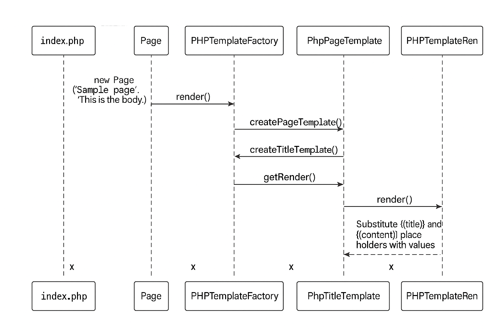

# 🏭 Abstract Factory Pattern

### ¿Para qué sirve?

El patrón Abstract Factory se utiliza cuando una aplicación necesita crear familias de objetos relacionados sin depender de sus clases concretas.
En otras palabras, permite cambiar fácilmente la “fábrica” de objetos (por ejemplo, de un motor de renderizado a otro) sin modificar el código que usa esos objetos.

### Cuándo usarlo

Se usa cuando tu sistema debe funcionar con múltiples variantes de productos (como interfaces gráficas, motores de plantillas, o sistemas de base de datos) y necesitas mantener el código desacoplado de las implementaciones específicas.

### Descripción del ejemplo

En este ejemplo, el patrón Abstract Factory se aplica para crear diferentes tipos de plantillas usadas en una página web.
Una aplicación puede trabajar con varios motores de renderizado, pero para mantener la flexibilidad, sus clases no deben depender de implementaciones concretas.

En lugar de crear directamente los objetos de plantilla, la aplicación delega esa tarea a una fábrica abstracta, que define cómo deben producirse los objetos sin especificar su tipo exacto.
De esta forma, si en el futuro se necesita cambiar el motor de renderizado, solo se sustituye la fábrica concreta sin alterar el resto del código.

### 🎯 Objetivo

En este ejemplo, el objetivo es crear un sistema que permita generar plantillas dinámicamente usando distintos motores de renderizado —Twig y PHPTemplate— sin modificar el código principal. Cada motor produce sus propias versiones de los mismos productos: una plantilla de título, una plantilla de página y un renderizador. Para lograrlo, utilizamos una fábrica abstracta que define qué productos deben crearse, y fábricas concretas (Twig y PHP) que implementan esa lógica según el motor seleccionado.

El resultado es un sistema más modular, extensible y fácil de mantener.


⸻

### Guía para implementar el patrón Abstract Factory en PHP (paso a paso)
```bash
Escenario general
	1.	Definimos que trabajaremos con dos motores de plantillas: Twig y PHPTemplate.
	2.	Cada motor debe poder:
	•	Crear títulos (TitleTemplate)
	•	Crear páginas (PageTemplate)
	•	Renderizar HTML (TemplateRenderer)

```

El renderizador se encarga de convertir una plantilla (con variables) en una cadena HTML final.

⸻

## 🟢 Proceso de codificación

1. Identificar los productos a fabricar

Los productos que queremos que nuestras fábricas creen son:

	•	TitleTemplate: plantilla de título.

	•	PageTemplate: plantilla de página.

	•	TemplateRenderer: renderizador.


Por lo tanto, creamos una interfaz para cada uno:
```bash
Template/
│   ├── TitleTemplate.php     ← Interfaz
│   └── PageTemplate.php      ← Interfaz
Renderer/
│   └── TemplateRenderer.php  ← Interfaz

```


2. Crear las clases concretas de productos

Como tenemos dos motores de plantillas, necesitaremos implementaciones concretas para cada uno.
Además, creamos una clase abstracta para evitar repetir código en las clases de página.

```bash
Template/
│   ├── TwigTitleTemplate.php           ← Implementa TitleTemplate
│   ├── TwigPageTemplate.php            ← Extiende BasePageTemplate
│   ├── PHPTemplateTitleTemplate.php    ← Implementa TitleTemplate
│   ├── PHPTemplatePageTemplate.php     ← Extiende BasePageTemplate
│   └── BasePageTemplate.php            ← Clase abstracta común
```
¿Por qué se usa BasePageTemplate?

Para evitar duplicar lógica que comparten TwigPageTemplate y PHPTemplatePageTemplate, como la propiedad $titleTemplate.


3. Crear las clases de renderizado concretas

Cada motor tiene su propia clase que implementa TemplateRenderer y sabe cómo renderizar:
```bash
Renderer/
│   ├── TwigRenderer.php            ← Implementa TemplateRenderer
│   └── PHPTemplateRenderer.php     ← Implementa TemplateRenderer

```


4. Crear la fábrica abstracta

Creamos una interfaz que defina los métodos para fabricar cada tipo de producto:

TemplateFactory.php   ← Interfaz abstracta

Métodos:

	•	createTitleTemplate(): TitleTemplate

	•	createPageTemplate(TitleTemplate $title): PageTemplate

	•	getRenderer(): TemplateRenderer


5. Crear las fábricas concretas

Estas clases implementan TemplateFactory y se encargan de crear productos específicos para cada motor:

```bash
Factory/
│   ├── TwigTemplateFactory.php        ← Implementa TemplateFactory
│   └── PHPTemplateFactory.php         ← Implementa TemplateFactory
```
Cada una sabe cómo construir títulos, páginas y renderizadores según su motor.


6. Crear la clase cliente (Page)

La clase Page actúa como cliente y utiliza una fábrica para generar los componentes necesarios sin saber su implementación concreta.

$page = new Page('Título', 'Contenido');


7.- Crear el  Autoloading 

Composer + autoloading PSR-4
El autoloading PSR-4 permite que PHP cargue automáticamente las clases cuando se necesitan, sin tener que escribir manualmente múltiples require_once en el index.php como se muestra a continuacion.

```php
/* 
Interfaces base (siempre primero)
require_once __DIR__ . '/Factory/TemplateFactory.php';
require_once __DIR__ . '/Template/TitleTemplate.php';
require_once __DIR__ . '/Template/PageTemplate.php';
require_once __DIR__ . '/Render/TemplateRender.php'; // ← corregido
require_once __DIR__ . '/Factory/TwigTemplateFactory.php';

Clases abstractas
require_once __DIR__ . '/Template/BasePageTemplate.php';

Implementaciones concretas
require_once __DIR__ . '/Template/TwingTitleTemplate.php';
require_once __DIR__ . '/Template/PHPTitleTemplate.php';
require_once __DIR__ . '/Template/TwingPageTemplate.php';
require_once __DIR__ . '/Template/PHPPageTemplate.php';
require_once __DIR__ . '/Render/TwingRender.php'; // ← corregido
require_once __DIR__ . '/Render/PHPTemplateRenderer.php'; // ← corregido

Fábricas concretas
require_once __DIR__ . '/Factory/TwigTemplateFactory.php';
require_once __DIR__ . '/Factory/PHPTemplateFactory.php';

Clases cliente y helpers
require_once __DIR__ . '/Client/Page.php';
require_once __DIR__ . '/Engine/Twing.php';
require_once __DIR__ . '/vendor/autoload.php';
*/

require_once __DIR__ . '/composer/autoload_real.php';

```  
Esto mejora significativamente la organización, mantenimiento y escalabilidad del proyecto.

	7.1.-Se crea archivo composer.json 

	7.2.-Se ejecuta: composer dump-autoload

	7.3.-Composer crea carpeta vendor 

	7.4.-Se remplasan todos los require_once por :  require_once __DIR__ . '/vendor/autoload.php';


8. Probar la implementación

En el archivo index.php, probamos la integración completa:

$page = new Page('Sample page', 'This is the body.');

echo "Testing actual rendering with the PHPTemplate factory:\n";
echo $page->render(new PHPTemplateFactory());


## 📁 Estructura del proyecto

```bash
/AbstractFactory
│
├── Client/
│   └── Page.php                       # Cliente que usa la fábrica
│
├── Engine/
│   └── Twing.php                      # Simulación del motor Twig
│
├── Factory/
│   ├── TemplateFactory.php           # Interfaz abstracta
│   ├── TwigTemplateFactory.php       # Implementación concreta Twig
│   └── PhpTemplateFactory.php        # Implementación concreta PHP
│
├── Render/
│   ├── TemplateRender.php            # Interfaz del renderizador
│   ├── TwingRender.php               # Implementación concreta Twig
│   └── PHPTemplateRenderer.php       # Implementación concreta PHP
│
├── Template/
│   ├── TitleTemplate.php             # Interfaz del título
│   ├── PageTemplate.php              # Interfaz de página
│   ├── BasePageTemplate.php          # Clase base para plantillas de página
│   ├── TwigTitleTemplate.php         # Título con sintaxis Twig
│   ├── PhpTitleTemplate.php          # Título con sintaxis PHP
│   ├── TwigPageTemplate.php          # Página con sintaxis Twig
│   └── PhpPageTemplate.php           # Página con sintaxis PHP
│
├── Diagramas/
│   └── AbstractFactory.png           # Diagrama ilustrativo
│
├── index.php                         # Archivo de prueba
└── README.md                         # Este archivo
```


## 🔵 EJemplo de ejecución con la familia PhpTemplateFactory

Tomando como ejemplo la fábrica PHPTemplateFactory, el flujo de ejecución es el siguiente:


#### 1. Instanciación de Page

En index.php se crea una instancia de la clase Page, pasándole como argumentos un título y un contenido:

$page = new Page('Sample page', 'This is the body.');

Esto llama al constructor de la clase Page, almacenando internamente los valores:
	•	$this->title = 'Sample page'
	•	$this->content = 'This is the body.'


#### 2. Llamada al método render de Page

Luego se llama al método render() del objeto $page, pasándole como argumento una instancia de la fábrica concreta PHPTemplateFactory:

echo $page->render(new PHPTemplateFactory());


#### 3. Uso de la fábrica dentro de Page::render()

Dentro del método render() de la clase Page, se reciben los siguientes objetos a través de la fábrica:

a) Creación del template de página

$pageTemplate = $factory->createPageTemplate();

Esto ejecuta el método createPageTemplate() de PHPTemplateFactory, que:
	•	Llama internamente a createTitleTemplate() para generar un objeto PhpTitleTemplate.
	•	Con ese objeto, instancia PhpPageTemplate, que lo recibe en su constructor.
	•	Retorna finalmente el objeto PhpPageTemplate.

b) Obtención del renderer

$renderer = $factory->getRenderer();

Este método retorna una instancia de PHPTemplateRenderer.


#### 4. Renderizado del contenido final

Se llama al método render() del renderer, pasando como parámetros:
	•	La plantilla HTML obtenida de $pageTemplate->getTemplateString(), que contiene placeholders como {{title}} y {{content}}.
	•	Un arreglo asociativo con los valores reales:

[
  'title' => $this->title,       // 'Sample page'
  'content' => $this->content    // 'This is the body.'
]


#### 5. Sustitución de valores en la plantilla

Dentro del método render() de PHPTemplateRenderer, se recorren las claves del arreglo asociativo y se sustituyen en el string HTML. Por ejemplo:

$templateString = str_replace('{{title}}', 'Sample page', $templateString);
$templateString = str_replace('{{content}}', 'This is the body.', $templateString);


#### 6. Retorno del contenido HTML final

El string HTML con los valores reemplazados es retornado desde PHPTemplateRenderer, luego desde Page::render() y finalmente impreso con echo en index.php.

#### 7. Diagrama de secuencia.



## 🔴 Resultado esperado

```bash
Testing actual rendering with the PHPTemplate factory:
<div class="page">
    <h1>Sample page</h1>
    <article class="content">This is the body.</article>
</div>


Forma de ejecutar : MacBookAir:~/Proyectos/Patrones/Creacionales/AbstractFactory$ php index.php

Resultado : 

Testing actual rendering with the PHPTemplate factory:
<div class="page">
    <h1> {{Title}} </h1>
    <article class="content">{{content}}</article>
</div>          


Testing actual rendering with the PHPTemplate factory:
<div class="page">
    <h1> {{Title}} </h1>
    <article class="content"><?= $content ?></article>
</div>
```

Ejemplo tomado de https://refactoring.guru/es/design-patterns/abstract-factory/php/example#example-1

==================================================